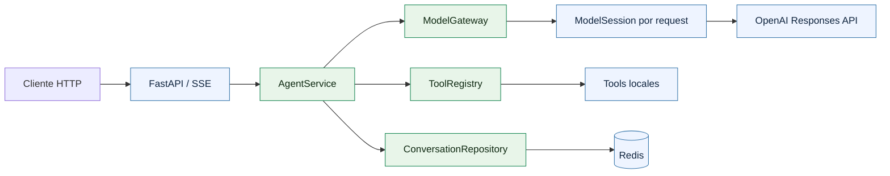
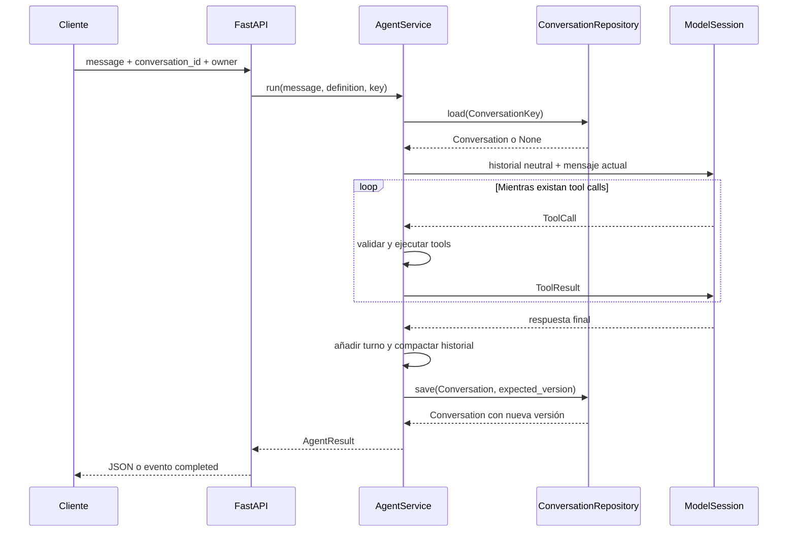

<div align="center">

# TesseraFlow

**Framework modular y multiusuario para agentes con tools asíncronas y salidas en tiempo real.**

[](https://www.python.org/)
[](https://fastapi.tiangolo.com/)
[](https://platform.openai.com/docs/api-reference/responses)
[](https://redis.io/)

Responses API · function calling · streaming SSE · historial persistente · concurrencia optimista

</div>

---

TesseraFlow es una base de referencia para construir agentes HTTP con límites
arquitectónicos claros. Ejecuta herramientas locales, conserva conversaciones neutrales
al proveedor y ofrece respuestas completas o streaming sin acoplar el núcleo a OpenAI,
Redis o FastAPI.

> [!NOTE]
> El proyecto todavía no incorpora autenticación. En producción, `user_id` y `tenant_id`
> deben obtenerse de un principal autenticado y no confiarse directamente al cliente.
> Consulta [ROADMAP.md](ROADMAP.md) para conocer las siguientes fases.

## Características

- Arquitectura por capas con dominio y casos de uso independientes del proveedor.
- Sesiones aisladas por request sobre un único cliente HTTP compartido.
- Function calling estricto con argumentos validados por Pydantic.
- Ejecución concurrente de las tools solicitadas en una misma respuesta.
- Respuesta completa y streaming SSE con semántica equivalente.
- Conversaciones multiusuario en Redis con TTL y límites de almacenamiento.
- Control de propiedad mediante `conversation_id`, `user_id` y `tenant_id`.
- Escrituras atómicas y detección de actualizaciones concurrentes.
- Logs estructurados que evitan registrar mensajes y datos de las tools.
- Puertos pequeños para sustituir OpenAI, Redis o las tools sin alterar el núcleo.

## Inicio rápido

### Requisitos

- Python 3.11 o superior.
- Una instancia de Redis accesible.
- Una API key de OpenAI.

### Instalación

```bash
python -m venv .venv
source .venv/bin/activate
make install
cp .env.example .env
```

Configura al menos estas variables en `.env`:

```dotenv
OPENAI_API_KEY=sk-...
REDIS_URL=redis://localhost:6379/0
```

Inicia Redis por el medio que prefieras. Por ejemplo, con Docker:

```bash
docker run --rm --name tesseraflow-redis -p 6379:6379 redis:7-alpine
```

En otra terminal, activa el entorno y arranca la API:

```bash
source .venv/bin/activate
make run
```

La API queda disponible en `http://127.0.0.1:8000` y la documentación interactiva en
[`http://127.0.0.1:8000/docs`](http://127.0.0.1:8000/docs).

### Primera petición

```bash
curl -X POST http://127.0.0.1:8000/v1/agent/run \
  -H 'Content-Type: application/json' \
  -d '{
    "message": "¿Cuánto es (125.50 * 3) + 20?",
    "conversation_id": "conv-123",
    "user_id": "user-456"
  }'
```

Respuesta simplificada:

```json
{
  "answer": "El resultado es 396.5.",
  "response_id": "resp_...",
  "conversation_id": "conv-123",
  "tool_calls": [
    {
      "call_id": "call_...",
      "tool_name": "calculator",
      "arguments": {"operation": "multiply", "a": 125.5, "b": 3},
      "status": "success",
      "output": {"result": "376.5"},
      "error": null,
      "duration_ms": 0.12
    }
  ]
}
```

## Arquitectura



La dirección de dependencias siempre apunta hacia el núcleo:

```text
api ----------> application <---------- infrastructure
                     |
                     v
                   domain
```

| Capa | Responsabilidad |
| --- | --- |
| `domain` | Conversaciones, eventos, respuestas y tool calls neutrales. |
| `application` | Orquestación del ciclo modelo → tool → modelo y definición de puertos. |
| `infrastructure` | Adaptadores de OpenAI, Redis y logging. |
| `api` | Schemas, rutas HTTP, SSE y traducción de errores. |
| `tools` | Capacidades independientes y registro central. |
| `bootstrap.py` | Composición de clientes, adaptadores y servicios concretos. |

`AgentService` solo conoce contratos como `ModelGateway` y `ConversationRepository`.
Los formatos de OpenAI —por ejemplo `function_call_output`— se traducen exclusivamente
en `OpenAIModelSession`.

## Pipeline de conversaciones

El historial se guarda como elementos del dominio, no como respuestas del SDK de un
proveedor:

```text
ConversationMessage | ToolCall | ToolResult
```

El flujo de una interacción es el siguiente:



### El puerto `ConversationRepository`

La aplicación define únicamente estas operaciones:

```python
class ConversationRepository(Protocol):
    async def load(self, key: ConversationKey) -> Conversation | None: ...
    async def save(self, conversation: Conversation) -> Conversation: ...
    async def delete(self, key: ConversationKey) -> bool: ...
```

Actualmente `bootstrap.py` conecta ese puerto con `RedisConversationRepository`. Para
usar PostgreSQL, MongoDB u otra base basta con implementar el mismo contrato y cambiar
la composición; `AgentService` y la API no necesitan conocer el nuevo almacenamiento.

### Persistencia en Redis

Cada conversación se almacena en un hash similar a este:

```text
conversation:v1:<sha256(conversation_id)>
├── user_id
├── tenant_id
├── version
└── messages     JSON neutral
```

- El identificador público se hashea antes de formar la clave Redis.
- El propietario se valida en cada lectura, escritura y borrado.
- `WATCH` / `MULTI` / `EXEC` implementan concurrencia optimista.
- Cada escritura incrementa `version` y renueva el TTL.
- Si dos requests cargan la misma versión, solo una puede persistir; la otra recibe un
  conflicto.
- Antes de guardar se conservan únicamente los turnos completos más recientes dentro
  de los límites configurados.

La conversación se persiste después de obtener la respuesta final. En streaming se
guarda antes de emitir el evento terminal `completed`, por lo que un stream exitoso ya
tiene su historial retenido.

## Streaming SSE

Usa `-N` para evitar que `curl` almacene la salida en un buffer:

```bash
curl -N -X POST http://127.0.0.1:8000/v1/agent/stream \
  -H 'Content-Type: application/json' \
  -H 'Accept: text/event-stream' \
  -d '{
    "message": "¿Cuánto es 125.50 multiplicado por 3?",
    "conversation_id": "conv-123",
    "user_id": "user-456"
  }'
```

El protocolo público utiliza eventos neutrales al proveedor:

| Evento | Significado |
| --- | --- |
| `text_delta` | Fragmento incremental del texto. |
| `tool_started` | Una tool validada está a punto de ejecutarse. |
| `tool_completed` | Resultado, estado, duración y posible error de la tool. |
| `completed` | Resultado final; siempre es el último evento exitoso. |
| `error` | El stream no pudo completarse; los detalles internos quedan en logs. |

```text
event: tool_started
data: {"call_id":"call_...","tool_name":"calculator"}

event: tool_completed
data: {"call_id":"call_...","tool_name":"calculator",...}

event: text_delta
data: {"text":"El resultado"}

event: completed
data: {"answer":"El resultado es 376.5.","response_id":"resp_...",...}
```

Los argumentos fragmentados se acumulan dentro del adaptador antes de exponer un
`ToolCall`. Si el cliente se desconecta, se cancela el generador y se cierra únicamente
el stream de esa request; el cliente compartido permanece disponible.

## Endpoints

| Método | Ruta | Descripción |
| --- | --- | --- |
| `GET` | `/health` | Liveness check sin consultar dependencias externas. |
| `POST` | `/v1/agent/run` | Ejecuta y persiste una interacción completa. |
| `POST` | `/v1/agent/stream` | Ejecuta la interacción mediante eventos SSE. |
| `DELETE` | `/v1/conversations/{conversation_id}` | Borra una conversación del propietario indicado. |

El endpoint de borrado recibe `user_id` y, opcionalmente, `tenant_id` como query params:

```bash
curl -X DELETE \
  'http://127.0.0.1:8000/v1/conversations/conv-123?user_id=user-456'
```

## Tools incluidas

| Tool | Capacidad |
| --- | --- |
| `calculator` | Suma, resta, multiplica y divide números decimales. |
| `current_time` | Devuelve fecha y hora para una zona horaria IANA. |

### Añadir una tool

1. Define un modelo de argumentos que herede de `ToolArguments`.
2. Implementa una clase `AgentTool` con una única capacidad.
3. Registra una instancia en `build_tool_registry()`.

```python
from typing import ClassVar

from pydantic import Field

from application.tools import AgentTool, ToolArguments


class CustomerInput(ToolArguments):
    """Arguments required to retrieve one customer."""

    customer_id: str = Field(description="Identificador interno del cliente")


class GetCustomerTool(AgentTool[CustomerInput]):
    """Retrieve the basic state of one customer."""

    name = "get_customer"
    description = "Obtiene los datos básicos de un cliente."
    arguments_model: ClassVar[type[CustomerInput]] = CustomerInput

    async def execute(self, arguments: CustomerInput) -> object:
        """Return the customer state for the validated identifier."""

        return {"customer_id": arguments.customer_id, "status": "active"}
```

El esquema neutral se genera desde Pydantic y cada gateway lo traduce al formato de su
proveedor. La validación, la medición, los logs y el tratamiento de errores son comunes
a todas las tools.

## Configuración

| Variable | Valor por defecto | Propósito |
| --- | --- | --- |
| `OPENAI_API_KEY` | — | Credencial de OpenAI. |
| `OPENAI_BASE_URL` | — | Base URL alternativa compatible. |
| `OPENAI_MODEL` | `gpt-5-mini` | Modelo usado por la definición por defecto. |
| `OPENAI_CONNECT_TIMEOUT_SECONDS` | `15` | Timeout de conexión. |
| `REDIS_URL` | `redis://localhost:6379/0` | Conexión al almacenamiento. |
| `MAX_TOOL_ROUNDS` | `8` | Límite contra bucles de tools. |
| `CONVERSATION_TTL_SECONDS` | `604800` | Retención desde la última escritura. |
| `CONVERSATION_MAX_MESSAGES` | `100` | Máximo de mensajes y elementos de tools. |
| `CONVERSATION_MAX_CHARACTERS` | `200000` | Límite lógico del historial. |
| `CONVERSATION_MAX_BYTES` | `512000` | Límite final del JSON serializado. |
| `LOG_LEVEL` | `INFO` | Nivel de logging. |
| `LOG_JSON` | `false` | Activa logs JSON estructurados. |

Consulta [.env.example](.env.example) para ver una configuración completa.

## Ciclos de vida y concurrencia

- `AsyncOpenAI` y el cliente Redis se crean una vez por proceso durante el `lifespan` y
  se cierran durante el apagado.
- Cada ejecución crea una `ModelSession` ligera con su propio estado efímero.
- No se guarda usuario, historial ni `response_id` en servicios compartidos.
- Las tools de una misma respuesta se ejecutan concurrentemente y sus resultados se
  devuelven juntos al modelo.
- Las cancelaciones se propagan y los streams se liberan mediante context managers.

## Seguridad y límites actuales

- Los logs no incluyen mensajes, argumentos, resultados, claves ni datos sensibles.
- Los errores esperables de una tool se convierten en resultados estructurados.
- Los historiales no se resumen automáticamente: se eliminan turnos antiguos completos
  para evitar alterar información sensible.
- Mensajes, argumentos y resultados sí forman parte del historial persistido. El
  cifrado, la clasificación de datos y la retención legal dependen del despliegue.
- Esta base no implementa todavía autenticación, autorización externa, cifrado a nivel
  de aplicación ni políticas regulatorias específicas.

## Desarrollo y calidad

Ejecuta todas las comprobaciones locales con:

```bash
make check
```

O de forma individual:

```bash
ruff format --check .
ruff check .
mypy src
pytest
git diff --check
```

La suite normal no necesita API keys, red ni servicios externos.

## Estructura del proyecto

```text
src/
├── api/                 # FastAPI, schemas y SSE
├── application/         # Casos de uso, puertos y orquestación
├── domain/              # Modelos y eventos neutrales
├── infrastructure/      # OpenAI, Redis y logging
├── tools/               # Tools concretas y registro
├── bootstrap.py         # Composición de dependencias
└── main.py              # Aplicación y lifespan
tests/                   # Tests unitarios de casos de uso y adaptadores
```

## Roadmap

Las capacidades futuras y las decisiones pendientes se mantienen en
[ROADMAP.md](ROADMAP.md). Esto evita presentar como disponible una funcionalidad que
todavía no está implementada.
